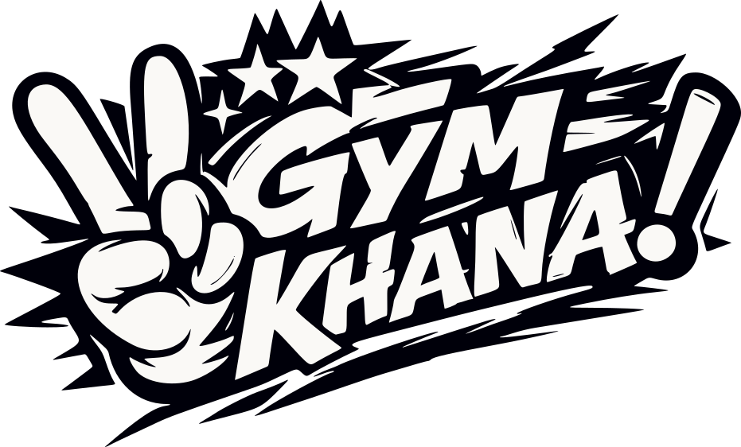
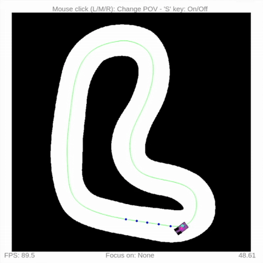

[](https://github.com/TeoIlie/Gym-Khana/actions/workflows/publish.yml)

# Gym-Khana

<a href="https://gym-khana.readthedocs.io/en/latest/">

</a>

This repository contains a custom gym environment for training Deep Reinforcement Learning policies to race and drift on 1/10 scale or full-size Ackermann vehicles. **SB3** and **wandb** integration included. Based on the f1tenth_gym simulator built by UPenn. For detailed information see the [documentation](https://gym-khana.readthedocs.io/en/latest/)

## Quickstart

Gym-Khana is available as a PyPI package with only the gym environment, or as a full repository with additional functionality.

Install the gym environment from PyPI with:

```bash
pip install gymkhana
```

Alternatively, to use all features, or for development (training, controllers, analysis, etc.), clone the full repo and install dependencies using `poetry`:

```bash
git clone --recurse-submodules https://github.com/TeoIlie/Gym-Khana.git
cd Gym-Khana
poetry install --all-groups
source $(poetry env info -p)/bin/activate # or instead of sourcing, prefix commands with `poetry run`
```

Then you're off to the races! 🏎️



You can run a quick waypoint follow example:

```bash
cd examples
python3 waypoint_follow.py
```

Or a simple centerline follow example:
```bash
cd examples
python3 controller_example.py
```

A Dockerfile is also provided with support for the GUI with nvidia-docker (nvidia GPU required):

```bash
docker build -t gymkhana -f Dockerfile .
docker run --gpus all -it -e DISPLAY=$DISPLAY -v /tmp/.X11-unix:/tmp/.X11-unix gymkhana
````

Then the same examples can be run.

## Additional Dependencies

MPC controllers require dependencies that cannot be installed via pip alone. For the reference MPC implementation see the ForzaETH [race_stack](https://github.com/ForzaETH/race_stack)

**acados** (build from source) — see the official [installation docs](https://docs.acados.org/installation/index.html) and [Python interface docs](https://docs.acados.org/python_interface/index.html):

```bash
# acados (build from source) - ~/software is only an example install directory
git clone https://github.com/acados/acados.git --recurse-submodules ~/software/acados
cd ~/software/acados && mkdir build && cd build
cmake -DACADOS_WITH_QPOASES=ON ..
make install -j$(nproc)

# Environment variables (add to shell profile)
export ACADOS_SOURCE_DIR=~/software/acados
export LD_LIBRARY_PATH=$LD_LIBRARY_PATH:~/software/acados/lib

```

Next, install the `acados_template` inside your virtual environment, with editable mode. For example, open a shell inside the virtual env with `poetry shell` and then run the following command:

```bash
# Python interface
pip install -e ~/software/acados/interfaces/acados_template
```

## Training
The main racing training script is at `train/ppo_race.py`. The recovery training script is at `train/ppo_recover.py`. Both include functionality for:
1. **Train** (`--m t`): Train a new model with parallel environments using `SubprocVecEnv` and `train/config` params
2. **Evaluate** (`--m e`): Evaluate a trained model with visualization
3. **Download** (`--m d`): Fetch a model from **wandb** and evaluate it
4. **Continue** (`--m c`): Continue training an existing model from a checkpoint
5. **Transfer** (`--m f`): Transfer a pretrained model to a new task, preserving network weights but resetting optimizer, LR schedule, and optionally resetting `log_std` for fresh exploration, and resetting critic network for fresh value approximation. Useful for transferring learned dynamics knowledge (e.g. racing to recovery).

For example, train a racing model with:

```bash
python3 train/ppo_race.py --m t
```

Detailed usage guidelines are at the top of the training script files.

## Configuration

### Default Gym/RL configurations

Default configurations are stored in `/train/config/env_config.py`, with parameters coming from `train/config/rl_config.yaml` and `train/config/gym_config.yaml`. This exposes all necessary Gym env and RL params for training, as well as default functions for getting Gym configs of RL training and testing environments:

1. `/train/config/env_config.py::get_drift_test_config()`
2. `/train/config/env_config.py::get_drift_train_config()`
3. `/train/config/env_config.py::get_recovery_test_config()`
4. `/train/config/env_config.py::get_recovery_train_config()`

### Callback and Curriculum Learning (CL) configuration

Default `SB3` callbacks used during training are `WandbCallback`, `CheckpointCallback`, and `EvalCallback`. A custom `CurriculumLearningCallback` is also available, which gradually expands the recovery state initialization ranges as the agent's success rate improves.

CL is configured in `/train/config/gym_config.yaml` under the `curriculum` heading by setting `enabled: true`. Parameters such as `n_stages`, `success_threshold`, and per-state ranges (`v_range`, `beta_range`, etc.) can be tuned there.

Note that CL is only supported for recovery training, with the environment `training_mode` set to `"recover"`. Recovery training is accessed through the training script `train/ppo_recover.py`.

### Debugging configuration

 `gym.make()` configurations:
 
1. Run with `render_mode` set to `human` to visualize the process
2. Set `"render_track_lines": True` (it is `False` by default) to render the centerline  in **green** and the raceline in **red**
3. Rendering track arc-length points **s** in Frenet coordinates at discrete intervals:
    1. First, `"render_arc_length_annotations": True` (it is `False` by default) to render points along the centerline in **orange** 
    2. Optionally, also set `"arc_length_annotation_interval"` to modify the point spacing (`2.0` metres by default)
4. Set `"render_lookahead_curvatures": True` (it is `False` by default) to visualize lookahead curvature sampling points ahead of the vehicle in **yellow**. Optional parameters:
5. Set `"debug_frenet_projection" = True` to visualize the Frenet coordinates are correct
6. Set `"record_obs_min_max"` to `True/False` to record min/max observation values during training, and tweak normalization bounds if necessary, defined in `utils.py::calculate_norm_bounds`

### Important configuration options

`gym.make()` configurations:

1. Set `training_mode` to define the training goal. This modifies the reset, initialization, track, and reward settings:
    1. `"race"` (default) is used by `train/ppo_race.py` for training racing policies 
    2. `"recover"` is used by `train/ppo_recover.py` to train policies for stabilizing an out-of-control vehicle 
2. Set `model` to `std` for drifting model with PAC2002 tire model
3. Use `control_input` `["accl", "steering_angle"]` for best RL drift training
4. Use parameter dictionary `params` as `GKEnv.f1tenth_std_vehicle_params()` or `GKEnv.f1tenth_std_drift_bias_params()` for drift parameters on 1/10 scale F1TENTH car
5. Lookahead curvature/width observations can be configured with spacing and number parameters, and when `render_lookahead_curvatures": True` these will be reflected
    1. `lookahead_n_points` - Number of lookahead points (default: 10)
    2. `lookahead_ds` - Spacing between points in meters (default: 0.3m)
    3. `sparse_width_obs` - `False` passes all lookahead point width values as observation, `True` only passes 1st and last. `True` is useful when track width varies very little (default: `False`)
6. Set `normalize_obs` to `True/False` for normalizing the observation space. Only specific observation types can be normalized
7. Set `normalize_act` to `True/False` for normalizing the action space. Supported for all action types
8. Set `predictive_collision` to `True` to use TTC collision checking and `False` for Frenet-based collision checking. Note that this also modifies the reward function.
9. Set `wall_deflection` to `False` to treat track edges as boundaries, and `True` to treat them as walls that cause a collision and halt the vehicle
10. Reward configuration options:
    1. `progress_gain`: set amount of gain by which to multiply forward progress reward. Must be >= 1
    2. `out_of_bounds_penalty`: penalty for driving off the track boundary
    3. `negative_vel_penalty`: penalty for driving backward
    4. `max_episode_steps`: the maximum number of episode steps
11. Set `track_direction` to define in which direction to drive around the track:
    1. `normal` (default): drive around the track in the direction of the waypoints stored in the centerline and raceline files (Note this may be CW or CCW depending on the track map)
    2. `reverse`: drive around in the opposite direction (For ex, CW instead of CCW)
    3. `random`: randomly drive in the 'regular' or 'reverse' direction at each reset with a 50% chance, to learn left and right cornering equally when training a policy with RL

`env.reset()` configurations:

1. **Poses** and **States** can be used to initialize vehicles at specific configurations. Note:
   - Only one of `poses` or `states` can be used per reset call (not both)
   - All **[x, y, yaw]** values are in Cartesian coordinates
   - To use Frenet coordinates, convert first using `frenet_to_cartesian()` in `gymkhana/envs/track/track.py`

2. **Poses**: Reset agents at a specific pose
   ```python
   # Single agent
   poses = np.array([[x, y, yaw]])
   env.reset(options={"poses": poses})

   # Multiple agents
   poses = np.array([[x1, y1, yaw1],
                     [x2, y2, yaw2]])
   env.reset(options={"poses": poses})
   ```

3. **States**: Reset agents to a full 7-d state (only for `model='std'`)
   ```python
   # Single agent: [x, y, delta, v, yaw, yaw_rate, slip_angle]
   states = np.array([[x, y, delta, v, yaw, yaw_rate, slip_angle]])
   env.reset(options={"states": states})

   # Front & rear angular wheel velocities are automatically initialized to form the full 9-d state for STD model type
   ```

## Wandb

The wandb models are available here: <https://wandb.ai/teo-altum-quinque-queen-s-university/projects>

## Custom Maps

Custom maps can be created using the git submodule <https://github.com/TeoIlie/F1TENTH_Racetracks> stored in folder `/maps`. Once updated, pull the update submodule with `git pull --recurse-submodules`

## Formatting/Linting

Run formatting and auto-fixes manually with `ruff check --fix . && ruff format .` Fixes also are applied before commits due to `.pre-commit-config.yaml` file, with `pre-commit` dependency.

## Important files

* `gymkhana/envs/base_classes.py:503` defines the `step` method.
  * the action space is defined as an `ndarray` with
    1. the first element being desired **steering angle**
    2. second element is desired **velocity**.
* dynamics models are defined in `gymkhana/envs/dynamic_models`
  * `single_track.py` models the single-track dynamics model, but only basic tire modelling
  * `single_track_drift.py` models the single-track dynamics model with PAC2002 tire model, ideal for drift training
  * `multi_body.py` models the car in greatest detail, but parameters are only available for a full-scale vehicle

## Tire parameters

* Parameters for the 1/10 scale f1tenth car to be used with the `STD` model are defined in `gymkhana/envs/gymkhana_env.py` as `f1tenth_std_vehicle_params`. They are created as a mix of existing f1tenth params and tire parameters adjusted from the fullscale car.
* In future I may measure these parameters from real data for more accurate fitting
* To maintain a history of parameter choices, and how they compare with the correct behaviour on the fullscale car, tests script `tests/model_validation/test_f1tenth_std_params.py` creates comparison figures along with parameter YAML file dump ordered by date created inside folder `figures/tire_params`

## Documentation

* Documentation is supported through ReadTheDocs Sphinx template at https://gym-khana.readthedocs.io
* Tagged versions are available via the version selector in the docs (bottom-left flyout)
* To update documentation modify `/docs` folder files and test locally, a rebuild will be triggered on push to default branch

```bash
cd docs
make clean && make html && firefox _build/html/index.html
```

## Versioning

This project follows [Semantic Versioning](https://semver.org/): `MAJOR.MINOR.PATCH`

* **MAJOR**: Breaking changes (incompatible API/config changes)
* **MINOR**: New features (backward-compatible)
* **PATCH**: Bug fixes (backward-compatible)

To release a new version:

1. Update `version` in `pyproject.toml` and `__version__` in `gymkhana/__init__.py`
2. Create and push a matching annotated git tag:

```bash
git tag -a v1.2.0 -m "description of release"
git push origin v1.2.0
```

Pushing the tag automatically publishes to TestPyPI and PyPI via the `publish.yml` GitHub Actions workflow.


## Known issues

* Library support issues on Windows. You must use Python 3.8 as of 10-2021

* On MacOS Big Sur and above, when rendering is turned on, you might encounter the error:

```
ImportError: Can't find framework /System/Library/Frameworks/OpenGL.framework.
```

You can fix the error by installing a newer version of pyglet:

```bash
pip3 install pyglet==1.5.11
```

And you might see an error similar to

```
gym 0.17.3 requires pyglet<=1.5.0,>=1.4.0, but you'll have pyglet 1.5.11 which is incompatible.
```

which could be ignored. The environment should still work without error.
