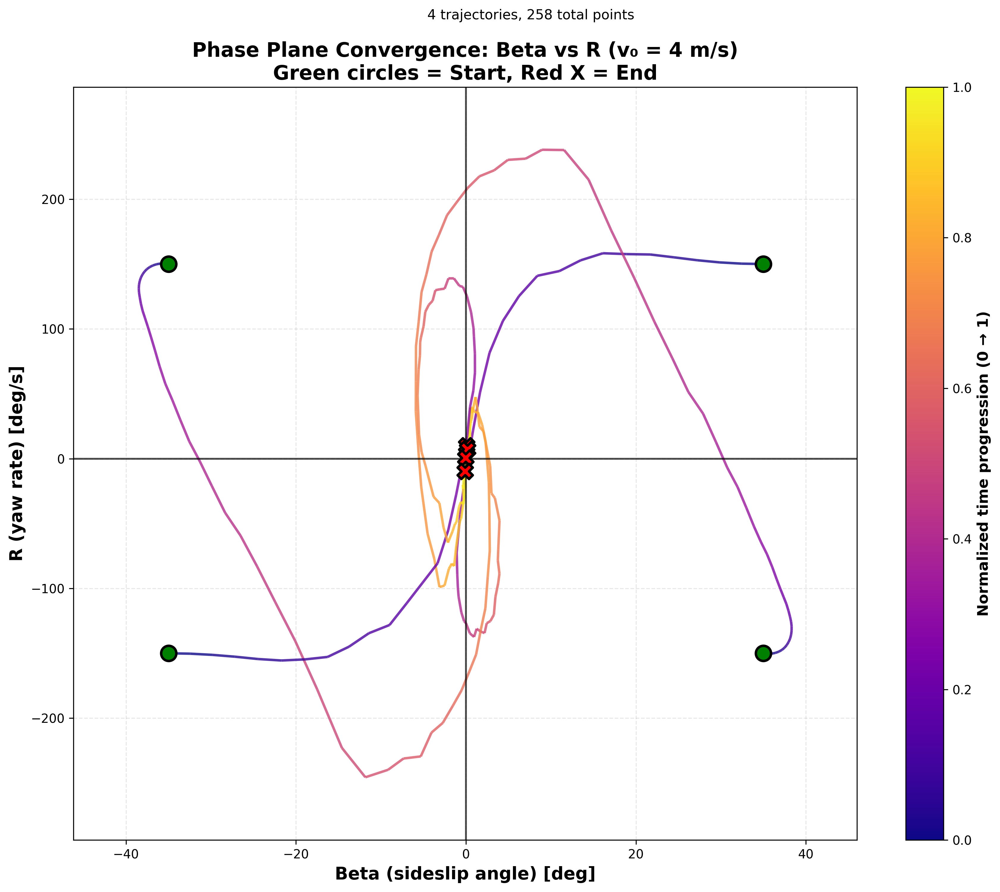
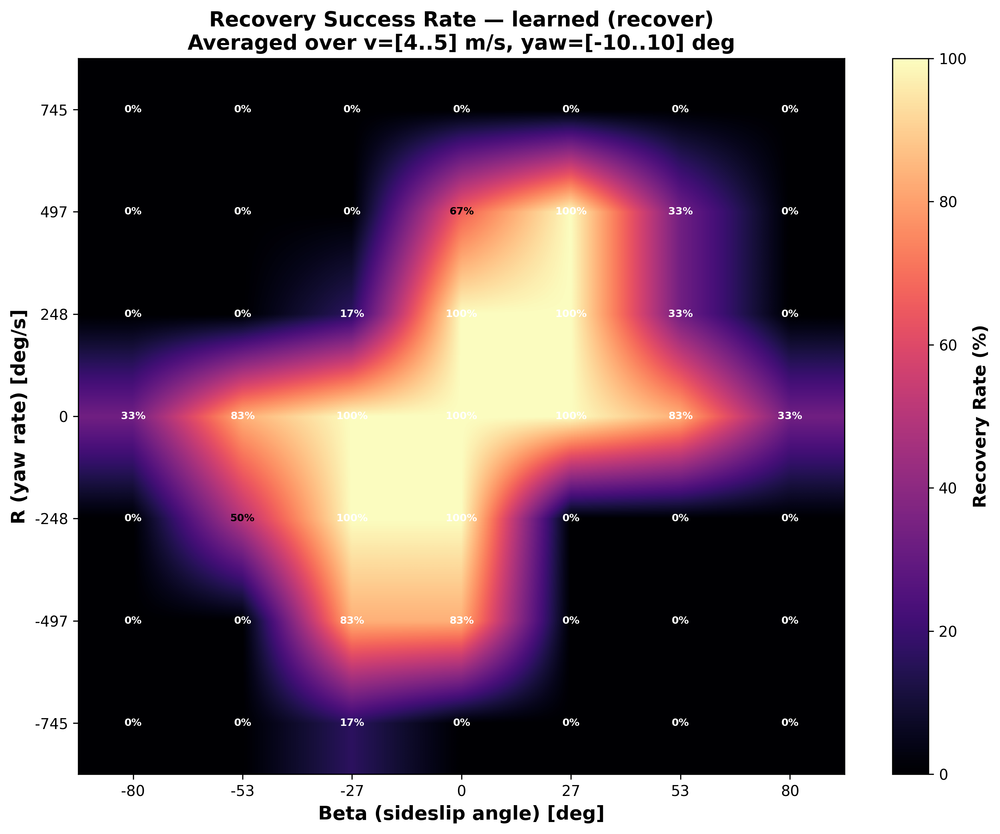
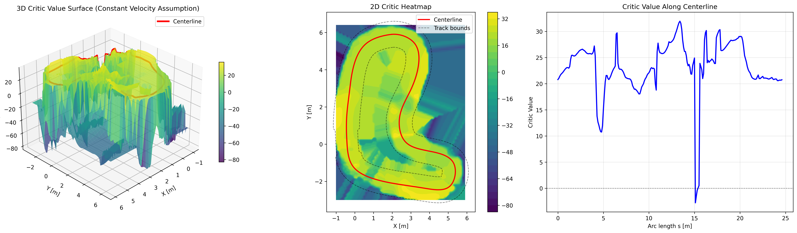

Analysis
========

Tire parameters
---------------

Parameters for the 1/10 scale F1TENTH car with the STD model are defined in ``gymkhana/envs/gymkhana_env.py`` as ``f1tenth_std_vehicle_params()``. They are a mix of existing F1TENTH params and tire parameters adjusted from a full-scale car.

To maintain a history of parameter choices and compare with correct full-scale behavior, the test script ``tests/model_validation/test_f1tenth_std_params.py`` creates comparison figures and parameter YAML dumps (ordered by date) in ``figures/tire_params/``.

Analysis scripts
----------------

Scripts in ``examples/analysis/`` provide tools for evaluating trained policies and visualizing vehicle dynamics.

**Phase plane analysis**

``beta_r_traj_Drift_large_plot.py``
   Collects sideslip angle (beta) and yaw rate (r) trajectories from a trained policy running on the Drift_large map over multiple laps, then plots them in a phase plane colored by arc-length position. Useful for visualizing steady-state drifting behavior.

``beta_r_traj_IMS_plot.py``
   Tests controller stability by initializing the vehicle at four extreme beta-r states (one per quadrant) on the IMS straight and observing convergence trajectories toward equilibrium at the origin.

``frenet_u_n_phase_plane.py``
   Runs multiple episodes and collects Frenet coordinate trajectories (heading error and lateral deviation), then visualizes phase plane vector fields showing the learned system dynamics with velocity-colored arrows.

**Recovery performance evaluation**

``beta_r_avg_plot.py``
   Evaluates recovery capability across a grid of initial (beta, r, velocity, yaw) conditions. Generates heatmaps showing recovery success rates per state for a given controller. Supports multiple controller types via ``--controller_type`` (``learned``, ``stanley``, ``stmpc``, ``steer``) and saves comparison metrics against a Stanley baseline.

``run_all_beta_r.sh``
   Batch script that runs ``beta_r_avg_plot.py`` for multiple learned controller configurations (drift and recover models) to systematically compare their recovery performance.

**Value function visualization**

``critic_value_3d_plot.py``
   Visualizes the PPO critic (value function) as a 3D surface over the track map. Creates a grid of positions and queries the trained model's value network to show expected returns. Usage: ``python3 critic_value_3d_plot.py --model-path /path/to/model.zip``

All analysis outputs are saved to ``figures/analysis/``.
